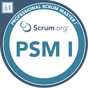

# Zoellner122

## About me!
Hi there!

As you can see I don't really code. I do want to code more and start learning about things like CI and CD. So most of my repo's are private so I can play around with code and stuff. Furthermore, I am a 26 year old 🏳(he / they) Dutchie, that fell in love with Linux and hasn't really looked back since. 

## Certifications / Badges

